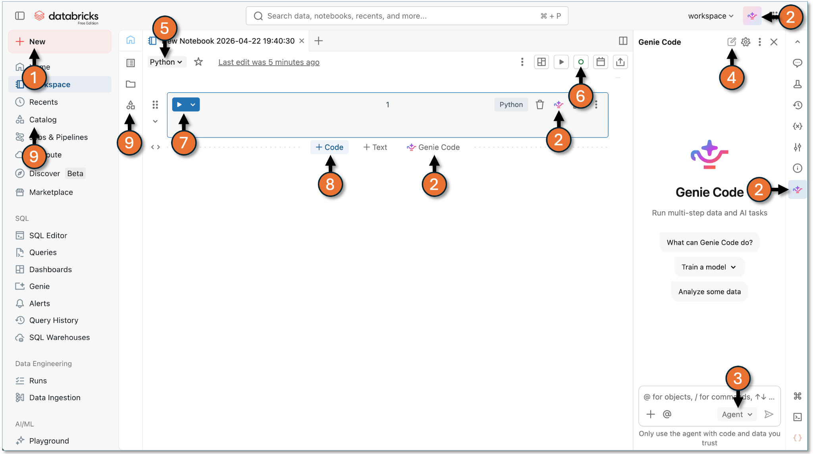
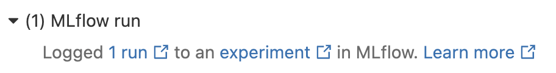

# Genie Code Workshop Labs (Free Edition)


Author: Barry Hodges, Databricks Senior Solution Architect, New Zealand

Version: 3

Date: 22-Jun-2026

**Contents**

## Introduction

[Genie Code](https://docs.databricks.com/aws/en/genie-code/) is an autonomous AI partner purpose-built for data work in Databricks. Unlike other AI assistants, Genie Code is deeply integrated with Unity Catalog, allowing it to understand your complete data landscape, including tables, columns, and lineage. This contextual awareness enables Genie Code to accelerate complex data workflows while autonomously adapting to your specific data and governance model. Genie Code is designed for data teams to use every day, from experimentation and model development to production pipelines and BI dashboards. It is available throughout the Databricks Lakehouse, and chat threads persist as you navigate between pages.

These hands-on labs will guide you through Genie Code's core capabilities using a [Databricks Free Edition](https://docs.databricks.com/aws/en/getting-started/free-edition) workspace.

### What you will cover

- **Lab 1: Getting Started - Modes and Navigation** - Get familiar with Genie Code basics.
- **Lab 2: Exploratory Data Analysis with Agent Mode** - Let Agent Mode autonomously plan and execute a full exploratory data analysis (EDA).
- **Lab 3: SQL Query Optimisation and Debugging** - Format, document, optimise, and repair broken SQL.
- **Lab 4: Lakeflow Designer** - Build a simple no-code ETL pipeline using the Lakeflow Designer canvas and prompts.
- **Lab 5a & 5b: Build a Data Transformation Workflow** - Construct a full medallion ETL pipeline, extending it iteratively via follow-up prompts.
- **Lab 6a & 6b: Data Analysis and Visualisation** - Create an AI/BI Dashboard from the Lab 5a or 5b tables - all driven by natural language.
- **Lab 7a & 7b: Price Prediction with Machine Learning** - Build, train, and evaluate an end-to-end ML model that predicts property price.
- **Lab 8: AI Functions** - Use various AI functions in Databricks such as ai_classify, ai_summarize and ai_query.
- **Lab 9: Genie Spaces** - Build a Genie Space to support natural language analysis.
- **Lab 10: Customise Genie Code** - Direct Genie Code to work the way you work.

**IMPORTANT**

- You can complete the labs in this guide without prior Databricks experience, but a basic understanding of Databricks concepts such as Notebooks, Lakeflow Spark Declarative Pipelines, Machine Learning, etc. will help you better appreciate Genie Code's value.
- Apart from the Setup lab, labs 1–5, 8–10 are standalone with no pre-requisite dependencies on any other lab. Labs 6 and 7 depend on the tables created in Lab 5.
- It is recommended you complete Labs 1–3 before trying any of the other Labs as this will get you familiar using Genie Code.
- Self-Directed Labs (5b, 6b, 7b)
  - These three labs cover the same ground as Labs 5a, 6a and 7a - but instead of giving you the prompts, they give you a starting point and a goal and let you drive the conversation with Genie Code.
  - They are intended for participants who are comfortable enough with Databricks and Genie Code to design the workflow themselves.
  - State outcomes, not steps. Tell Genie Code what you want, not how to build it. Iterate via follow-ups when the first attempt isn't quite right.
- Instructions in earlier labs are in some cases more verbose than later labs - the assumption is you don't need every specific detail as you move through labs. For example, at the start of most of the labs there is a check list of steps you must complete before proceeding (**similar** to the following). **Missing any means you will almost certainly run into problems**. Completing the Setup will help you understand how to complete these steps.

> [!NOTE]
> '**+ New**' → '**Notebook**' ✅, Default language '**SQL**' ✅, Genie Code pane open ✅, '**New Chat**' ✅, **Agent** Mode ✅

- You don't need to complete every lab in a single sitting. Focus on the ones most relevant to your role. Keep in mind that these labs run on the Free Edition - true to its name, it remains free - so you can progress at your own pace.

### Working with Free Edition and Genie Code

- **Free Edition shares back-end resources** and has daily serverless compute [quotas and other limitations](https://docs.databricks.com/aws/en/getting-started/free-edition-limitations#compute-limitations), so expect it to be slower than production Databricks and potentially throttled (quotas reset the next day). But hey, it's free 🙂.
- **Genie Code is non-deterministic** - your results may vary. So:
  - Always **review generated code** before executing - Genie Code is powerful but can make mistakes.
  - **Be specific** - more context = better output. Include column names, expected formats, and desired visualisation types.
  - **Try both modes** - switch between Agent Mode (for doing) and Chat Mode (for understanding) to see how they differ.
  - **Work in one chat per lab** - context compounds, and Genie Code gets better at predicting what you want as the conversation grows.
  - **If Genie Code goes off-track** - stop it (red square button) and re-prompt rather than letting it build on a bad foundation.
  - **Most importantly, play** - write your own prompts to explore. If you get errors, work with Genie Code to resolve.
- **Use** @<table-name> **to point Genie Code at a specific table**. When you paste a fully-qualified name from this doc (e.g. @samples.tpch.orders), click the pasted text and select the table from the picker. Shortcut: type just @orders and pick the right one from the list.
- **Approvals and controls** - Genie Code often pauses for your input as it works. For more complex tasks it may first lay out a step-by-step plan and ask clarifying questions - answer these to help it refine the plan. Before running any code it asks for your approval: click '**Allow**', '**Skip**', '**Decline**', '**Continue**', or '**Reject**' as appropriate. To cut down on prompts you can choose '**Allow in this thread**' or '**Always allow**', or turn on [**Auto-approve**](https://docs.databricks.com/aws/en/genie-code/use-genie-code#set-a-default-approval-mode) - an AI classifier that checks each proposed action against your stated intent and allows or blocks it automatically, minimising manual approvals while still stopping risky ones. For these labs we recommend clicking '**Allow**' one step at a time so you can see exactly what Genie Code is doing. To stop it mid-task, click the stop button.
- Genie Code can generate and run code in your notebook. While it has guardrails to prevent dangerous actions and respects the user’s Unity Catalog permissions,, there is still risk. Use it only with code and data you trust.
- Genie Code is a **rapidly evolving** technology. The experience and features may change (for the better) when you next try these labs.

### Resources:

- [Databricks Free Edition Documentation](https://docs.databricks.com/aws/en/getting-started/free-edition)
- Genie Code Documentation ([AWS](https://docs.databricks.com/en/genie-code/index.html), [Azure](https://learn.microsoft.com/en-nz/azure/databricks/genie-code/), [GCP](https://docs.databricks.com/gcp/en/genie-code))
- [Introducing Genie Code](https://www.databricks.com/blog/introducing-genie-code) - launch announcement and feature overview
- [Get to Know Genie Code](https://www.databricks.com/resources/demos/videos/get-know-genie-code) - demo covering pipelines, dashboards, and Agent Mode
- [Databricks YouTube Channel](https://www.youtube.com/@Databricks/search?query=%22genie%20code%22) (filtered by 'Genie Code') - tutorials and demos
- [Databricks Genie Code: Full Practice Guide and Examples](https://medium.com/dbsql-sme-engineering/databricks-genie-code-full-practice-guide-f3bcb13596f2)
- [From Genie to Genie Code: Agentic Data Work on Databricks](https://medium.com/data-science-collective/from-genie-to-genie-code-agentic-data-work-on-databricks-039593b01689)
- [Agentic Data Engineering with Genie Code and Lakeflow](https://www.databricks.com/blog/agentic-data-engineering-genie-code-and-lakeflow?utm_source=bambu&utm_medium=social&utm_campaign=advocacy)

## The [Databricks Workspace UI](https://docs.databricks.com/aws/en/workspace/navigate-workspace) (after clicking '+ New', 'Notebook')



- Click to create a new Notebook / ETL Pipeline / etc.
- Bring up the Genie Code panel
- Toggle Genie Code between **Chat** and **Agent** modes
- Start a new chat
- Toggle Notebook default language between **Python** and **SQL**
- Select compute type (**Serverless** or **Serverless Starter Warehouse**)
- Run Cell
- Click '**+ Code**' to add an empty cell below the current cell
- Unity Catalog - explore data related objects

## Setup

**Objective:** Setup your Databricks Free Edition workspace; Create a schema where objects such as tables will be created.

- If you haven't already, sign up for **Databricks Free Edition** at [databricks.com/try-databricks](http://databricks.com/try-databricks) (work or personal email).
- Once connected to your Databricks Free Edition workspace, click on the **Genie Code** icon in the upper-right corner.
- This opens the Genie Code pane. Maximize the pane by clicking on the **Open Full Chat** icon in the top-left corner of the pane.
- Ensure '**Agent**' (versus '**Chat**') is selected at the bottom right.
- In the chat pane, type the following prompt:

```text
Create a new schema workspace.genie_demo.
```

- When prompted, click '**Allow**' so Genie Code can run the generated code and create the schema which is used by several of the labs.

## Lab 1: Getting Started - Setup, Modes and Navigation

**Objective:** Setup your Databricks Free Edition workspace; Learn to interact with Genie Code; Explore the UI; Use @ table references.

> [!NOTE]
> '**+ New**' → '**Notebook**' ✅, Default language '**SQL**' ✅, Genie Code pane open ✅, '**New Chat**' ✅, **Agent** Mode ✅

- In the chat pane, type the following prompt:

```text
What tables are available in the samples.tpch schema? Describe each table and how they relate to each other.
```

- Genie may ask to run code, potentially multiple times. During these labs we recommend you accept the default '**Ask every time**' and click '**Allow**'.
- Review the final response. Genie Code uses Unity Catalog metadata to describe the tables and their relationships.
- Use the @ reference to ask a specific question about a specific table (remember the tips above in Working with Free Edition and Genie Code):

```text
How many columns does @samples.tpch.orders have? What does each column represent?
```

- Next, ask Genie Code to generate a simple query:

```text
Write a SQL query that shows the top 10 customers by total order value from @samples.tpch.orders and @samples.tpch.customer.
```

- Genie Code should generate the SQL in a new cell in the notebook. When prompted to run the cell, click '**Allow**' in the Genie Code pane.

You may also see '**Run suggested**', '**Reject**', and '**Accept**' buttons in the cell - ignore them and drive execution via Genie Code's '**Allow**'.

- Try the /explain command. Either:
- click the Genie icon at the top of the SQL cell and type /explain
- any where in the SQL cell, press '**Cmd+I**' (Mac) or '**Ctrl+I**' (Windows) and type /explain
- in the Genie Code pane type /explain or explain this query line by line
- Note there are several other [/ commands](https://docs.databricks.com/aws/en/notebooks/code-assistant#cell-actions) you can use with Genie Code including (but not limited to):
  - /findTables - searches for relevant tables based on Unity Catalog metadata
  - /getTableLineages - view upstream and downstream dependencies.
  - /getTableInsights - access metadata-driven insights, such as user activity and query patterns.
- Switch Genie Code to '**Chat**' mode (bottom right of the Genie Code panel where it should currently show '**Agent**'). Enter the following question:

```text
What is a window function in Spark? How does it differ from a regular GROUP BY? When would I use one over the other?
```

- Follow up with:

```text
What is the difference between RANK(), DENSE_RANK(), and ROW_NUMBER()? Show me an example using samples.tpch.orders where the difference matters - where the three functions produce different results.
```

- If example code appears in the Genie Code pane, use the '**<<**' or the **Copy code** button at the top of the snippet to insert it / copy / paste into a new SQL cell.

To create a new cell, move the mouse below the last cell until '- - - **+Code +Text** **Genie Code** - - -' pops up - click on '**+Code**'.

Once the code has been entered into the new cell, run the sql statement (click the '►' run cell button top left). Verify you can see where the three functions diverge.

## Lab 2: Exploratory Data Analysis with Agent Mode

**Objective:** Use Genie Code to perform a full exploratory data analysis on a dataset, demonstrating Genie Code's ability to plan, execute, and iterate autonomously.

- You can complete this lab entirely within the Genie Code Pane or in a Notebook.

If you want to do this in a Notebook:

> [!NOTE]
> '**+ New**' → '**Notebook**' ✅, Default language '**Python**' ✅, Genie Code pane open ✅, '**New Chat**' ✅, **Agent** Mode ✅

If you want to do this entirely within the Genie Code Pane:

> [!NOTE]
> **Genie Code** icon in the upper-right corner ✅. **Open Full Chat** icon in the top-left corner of the pane ✅, **Agent** Mode ✅

- Enter the following prompt:

```text
Perform an exploratory data analysis on @samples.nyctaxi.trips. Include: row count, schema overview, summary statistics for numeric columns, distribution of trip distances, fare amount trends by hour of day, and identify any data quality issues. Use Python with matplotlib for visualisations.
```

- Watch as Genie Code plans the analysis steps / creates multiple notebook cells.
- If you encounter any errors, follow the prompts to use Genie to diagnose the error and rerun revised code (this may be easier to do by clicking '**Accept**' in Genie Code and have it run the cells again for you - it should handle any errors via retry, repeating if necessary until it works).
- If you haven't already, in the Genie Code pane click **Allow** to run all cells. It will re-execute the same cells which is ok before moving on to summarise its findings.
- Now ask a follow-up question in the Genie Code pane:

```text
Based on the EDA, what are the most interesting patterns? Are there any outliers worth investigating?
```

- Let Agent Mode dig deeper into the patterns it identified (which is likely to include additional code cells - run these via the Genie Code pane when prompted).
- Review the deeper analysis.

## Lab 3: SQL Query Optimisation and Debugging

**Objective:** Use Genie Code's slash commands to tidy up, optimize and diagnose errors in SQL queries.

> [!TIP]
> **New in this lab:** Genie Code includes three commands aimed at SQL hygiene and performance: /prettify (formatting), /doc (inline comments) and /optimize (rewrite for performance). When a cell errors, Genie Code's Diagnose Error feature reads the failure, proposes a fix, and offers to re-run. Some commands run from the Genie Code pane and some from the inline assistant (Cmd+I / Ctrl+I) - the lab points out which is which.

> [!NOTE]
> '**+ New**' → '**Notebook**' ✅, Default language '**SQL**' ✅, Genie Code pane open ✅, '**New Chat**' ✅, **Agent** Mode ✅

- Paste the following SQL statement into the empty cell at the top of the Notebook - this is intentionally suboptimal and messy:

```sql
SELECT c.c_name, sum(l.l_extendedprice * (1 - l.l_discount)) as revenue
FROM samples.tpch.customer c, samples.tpch.orders o, samples.tpch.lineitem l
WHERE c.c_custkey = o.o_custkey and o.o_orderkey = l.l_orderkey
AND o.o_orderdate >= '1994-01-01' and o.o_orderdate < '1995-01-01'
GROUP BY c.c_name ORDER BY revenue DESC
```

- Using the Genie Code pane, type:

`/prettify`

- You should see the original version highlighted in red and recommended changes highlighted in green. Click '**Accept'** to accept the formatted version. The query should now be more readable.
- This next step does not happen in the Genie Code pane! Instead, highlight the SQL code in the cell, and either click the kebab at the top right of the cell and click on the Genie icon or press '**Cmd+I**' (Mac) or '**Ctrl+I**' (Windows), and type:

`/doc`

- '**Accept**' the documentation - Genie Code will add clear inline comments explaining the query logic.
- Run the cell (hit the '►' run cell button top left).
- Back in the Genie Code pane, type:

```text
Is the query suboptimal? If so, why?
```

- Ask Genie Code to optimise it.

`/optimize`

- Review the suggested changes - Genie Code may suggest replacing implicit joins with explicit JOIN syntax, adding appropriate filters, or restructuring the query.
- **Accept** and run the adjusted code via the Genie Code pane - once done you should get an explanation why this new version is an improvement of the previous version.
- An '**Optimize**' button also appears at the bottom right of the SQL cell. Optionally click it for a post-execution analysis, and apply any further recommendations.
- If you ran the query before and after /optimize, try '**compare execution times**' (offered as a button, or type it into Genie Code if you don't see this button).
- Now, create a new SQL cell with the following broken SQL query (move the mouse below the last cell until '- - - **+Code +Text** **Genie Code** - - -' pops up - click on '**+Code**'):

```sql
SELECT c_name, total_spent
FROM samples.tpch.customer
JOIN (
```

```sql
SELECT o_custkey, SUM(o_totalprice) AS total_spent
FROM samples.tpch.orders
WHERE o_orderdate > '1998-01-01'
GROUPBY o_custkey
) AS order_totals
ON c_custkey = order_totals.o_custkey
```

- Run the cell - it will fail.
- Genie Code may go straight to '**Attempting to fix**'. If not, click the '**Diagnose Error**' button that appears in the cell output.
- Genie Code will identify the issues (e.g., GROUPBY should be GROUP BY, possible date range issues) and suggest a quick fix. Click '**Allow'** to apply and re-execute.

## Lab 4: Data Workflow with Lakeflow Designer

**Objective:** Build a no-code ETL pipeline in Lakeflow Designer that uploads a CSV, applies quality transforms (case normalisation + a row filter), joins to a second source from Unity Catalog, aggregates, and writes a result table - all driven by Genie Code from the Designer canvas.

> [!TIP]
> **New in this lab:** Lakeflow Designer is a visual, no-code pipeline builder for ETL on Databricks. It uses a drag-and-drop canvas plus Genie Code, so a business analyst can build a production-grade pipeline without writing code. Behind the scenes, every Designer pipeline compiles down to a Lakeflow Spark Declarative Pipeline (see Labs 5a and 5b) - so it gets the same governance (Unity Catalog), observability, scheduling and reliability as a hand-coded pipeline. See [Announcing Lakeflow Designer](https://www.databricks.com/blog/announcing-lakeflow-designer-no-code-etl) / [Lakeflow Pipelines Editor](https://docs.databricks.com/aws/en/ldp/multi-file-editor).

> [!NOTE]
> '**+ New**' → '**Notebook**' ✅, Default language '**SQL**' ✅,

- Paste the following SQL statement into the empty cell at the top of the Notebook:

```sql
SELECT *
FROM samples.tpch.orders
WHERE o_orderdate >= DATE '1998-07-01'
LIMIT 1000;
```

- In the result table, click the download icon ( **∨** ) at the bottom-left of the result grid and choose '**Download CSV**'**.** Save the file as '**orders_recent.csv**' somewhere easy to find on your laptop.
- Click '**+ New**' → '**Visual data prep**'. The Lakeflow Designer canvas opens.
- Click '**Upload a file**', click on '**browse**', '**select files**' and select '**orders_recent.csv**' from your laptop.
- When prompted for a destination Volume, click '**+ Create volume**'.
  - Volume name = '**uploads**',
  - Volume type = '**Managed volume**'
  - Catalog = '**workspace**'
  - Schema = '**genie_demo**'
- Click '**Create**' and then '**Upload**'. If processing does not move past “Preview” after a minute, refresh the browser tab.
- Once the upload finishes a new Source node appears on the canvas, connected to the uploaded '**orders_recent.csv**' file (which is now stored in the volume you created).
- In the Preview section below, scan the columns and notice:
  - 'o_orderpriority' holds values like 1-URGENT, 2-HIGH, etc. - already upper-case in this dataset, but we'll demonstrate a case-normalisation transform on it anyway.
  - 'o_totalprice' ranges across small and large orders. We'll filter out orders below 50,000.
- In the following steps you will use Genie Code to do the work. Note however you have the option of doing everything yourself by dragging operators from the left menu onto the Designer canvas and / or by right clicking on the canvas and selecting the required operator from there.
- Also, unlike previous labs where you have used the Genie Code pane from the top-right of the page, this time you have the option of using the Genie Code pane at the bottom of the canvas. What follows assumes you are using the Genie Code pane on the Designer canvas.
- In the Genie Code pane on the Designer canvas, enter the following prompt:

```text
Remove rows where o_totalprice is less than 50000 and lower-case the o_orderpriority column.
```

- Genie Code should create two new operators connected downstream from the source. Click '**Accept All**'.
- Inspect the filter node:
  - Click the filter node, then the Edit operator icon. This will open the editing pane on the right where you can see an expression being applied to the source data similar to o_totalprice is greater than or equal to "50000".
  - Sort the output preview at the bottom right by o_totalprice ascending and confirm the smallest value is now ≥ 50,000. The row count (at the very bottom) should also drop from the 1000 rows showing under the Input preview.
- Inspect the case-lowering node:
  - Click the case-lowering, then the Edit operator icon - you should see something like LOWER(o_orderpriority).
  - Compare o_orderpriority in the Input / Output previews to confirm the column is now lower-case in the output.
- Add the customer dimension as a second source. Using Genie Code, prompt:

```text
Add samples.tpch.customer as a source.
```

- Click '**Accept All**'.
- Click on the Customers source operator, then change '**Rows scanned: Limit**' to '**Rows scanned: Max**' under the output pane (see very bottom of the output pane). This ensures all the rows from the customer table are brought through in the preview.
- Ask Genie Code to join the two datasets:

```text
Join the orders source with the customer source. Every order should show the customer details.
```

- Click '**Accept All**'.
- Tidy the canvas: right-click on the canvas and click on the **Auto layout** button or select it from the top of the canvas.
- Click the Join node, then the Edit operator icon. Note:
  - The join keys (o_custkey = c_custkey).
  - The join type (Left join)
  - The rows produced in the output include both fact and dimension columns (e.g. o_totalprice and c_name).
- Ask Genie Code to aggregate:

```text
Give me the average o_totalprice, and the count of orders, grouped by customer market segment (c_mktsegment).
```

- Click '**Accept All**'.
- Inspect the new aggregation node - Logic and Input/Output preview should show one row per market segment with the average price and order count.
- Ask Genie Code to write the results to a table:

```text
Write the data to a table orders_avg_by_segment in the schema workspace.genie_demo.
```

- Click '**Accept All**'.
- Click on the final output node,then the Edit operator icon - you should see '**Run**' in the operator editor.
- Click '**Run**'.
- Once the run has successfully finished, click on '**View in Catalog'** in the operator editor (table symbol on the top right). This will open Unity Catalog in a new tab.
- Click '**Sample Data**' (you may need to start the compute). You should see five rows - one per TPC-H market segment (AUTOMOBILE, BUILDING, FURNITURE, HOUSEHOLD, MACHINERY) with average price and order count.
- Click '**Lineage**', '**See lineage graph**' to see the associated python notebook (which always opens in Lakeflow Designer) and sources (orders_recent.csv file in the volume and the customers table in the samples.tpch schema).

## Lab 5a: Data Workflow with Lakeflow Spark Declarative Pipelines

**Objective:** Use Genie Code to build a simple data transformation workflow using Lakeflow Spark Declarative Pipelines, demonstrating Genie Code's data engineering capabilities. **This lab contains all the prompts you need to achieve the objective. If you prefer more DIY, skip to Lab 5b.**

> [!TIP]
> **New in this lab:** Lakeflow Spark Declarative Pipeline is a declarative, framework-managed way to build batch or streaming ETL pipelines in SQL or Python. You describe the target tables you want; Databricks figures out the dependencies, ordering, retries, and incremental processing for you. Pipelines are governed by Unity Catalog and run on Databricks Runtime. See [Lakeflow Spark Declarative Pipelines](https://docs.databricks.com/aws/en/ldp/) / [Concepts](https://docs.databricks.com/aws/en/ldp/concepts) / [Medallion architecture](https://docs.databricks.com/aws/en/lakehouse/medallion).

> [!NOTE]
> '**+ New**' → '**ETL pipeline**' ✅, Default language '**SQL**' ✅, Genie Code pane open ✅, '**New Chat**' ✅, **Agent** Mode ✅

- In the ETL Pipeline UI, change the pipeline catalog and schema from '**workspace.default**' to '**workspace.genie_demo**' (top left) to avoid catalog permission issues.
- Enter the following prompt to create the bronze tables:

```text
Create a pipeline with bronze streaming tables that ingest samples.wanderbricks tables properties, reviews, hosts, amenities, property_amenities, destinations. No transformations, just add table comments. Target schema workspace.genie_demo.
```

- Genie Code may go ahead and create the sql files required to complete this step. Genie Code may instead provide you with a plan (e.g. you may see something like 'Does this structure work for you, or would you like to modify the naming or organization?', followed by some suggested follow up prompts. Click the prompt that creates the sql files (e.g. 'Yes, proceed with this structure').
- Feel free to click on any of the generated sql files to see the sql code generated for each table.
- When prompted '**Dry-running pipeline**', click '**Allow**'. You may also get warned "**blocked execution for safety reasons**" - click '**run**' to continue.
- Dry-running the pipeline checks the code to make sure it works as a unit. If the Dry run fails, it should diagnose what went wrong and retry.
- Once the Dry run completes without error you will be prompted to '**Running pipeline**'. Click '**Skip**'.
- Now ask Genie Code to create the silver tables:

```text
Add silver tables in same schema that clean the bronze layer: cast prices to double and dates to date type, put in expectations that drop rows where base_price is null or zero, join amenities to property_amenities to get amenity names per property, aggregate reviews per property (avg scores, review count, most recent review date), standardise categoricals to lowercase. Calculate host_tenure_days from host start date.
```

- When prompted '**Dry-running pipeline**', click '**Allow**'.
- Once the Dry run completes without error you will be prompted to '**Running pipeline**'. As before, click '**Skip**'.
- Finally ask Genie Code to create the gold table:

```text
Add a gold table gold_price_prediction_features in the same schema that joins all silver tables into one denormalised row-per-property table. Include base_price, property features, host features including host_tenure_days, destination/location features, aggregated review metrics, and pivot the top 15 most common amenities into binary flag columns. Add calculated features, price_per_person and price_per_bedroom. Add column comments.
```

- When prompted '**Dry-running pipeline**', click '**Allow**'.
- Once the Dry run completes without error, when prompted with '**Running pipeline**', this time click '**Allow**' (alternatively click '**Run Pipeline'** in the top right).
- Once the pipeline starts running, click on ’**Pipeline graph**’ (bottom centre) and monitor the pipeline run.
- After the pipeline completes, you can toggle back to Genie Code to see final checks and messages Genie Code applied.
- Click on '**Runs**' under '**Data Engineering**' in the left hand menu navigator.
- Click on '**Pipelines**' - you should see your pipeline execution. Click on the pipeline Start time or Name to open the pipeline run and explore.
- In the Pipeline graph, hover over gold_price_prediction_features, click the kebab (3 dots) → '**View in catalog**'. In the Unity Catalog tab that opens, click '**Sample Data**' to see the rows (you may need to click '**Select Compute**' first).

## Lab 5b: Data Workflow with Lakeflow Spark Declarative Pipelines (Self-Directed)

**Objective:** Use Genie Code to build a simple data transformation workflow using Lakeflow Spark Declarative Pipelines, demonstrating Genie Code's data engineering capabilities - design and prompt the pipeline yourself **(refer Lab 5a if you need help)**.

> [!TIP]
> **New in this lab:** Lakeflow Spark Declarative Pipeline is a declarative, framework-managed way to build batch or streaming ETL pipelines in SQL or Python. You describe the target tables you want; Databricks figures out the dependencies, ordering, retries, and incremental processing for you. Pipelines are governed by Unity Catalog and run on Databricks Runtime. See [Lakeflow Spark Declarative Pipelines](https://docs.databricks.com/aws/en/ldp/) / [Concepts](https://docs.databricks.com/aws/en/ldp/concepts) / [Medallion architecture](https://docs.databricks.com/aws/en/lakehouse/medallion).

> [!NOTE]
> '**+ New**' → '**ETL pipeline**' ✅, Default language '**SQL**' ✅, Genie Code pane open ✅, '**New Chat**' ✅, **Agent** Mode ✅

- At the top of the pipeline UI ensure the catalog/schema is set to workspace.genie_demo (top left)
- **Starting point:** The samples.wanderbricks schema contains source tables for short-term-rental property data: properties, reviews, hosts, amenities, property_amenities, destinations.
- **Goal:** A Lakeflow Spark Declarative Pipeline producing a single gold table gold_price_prediction_features, ready to feed an ML model that predicts base_price. The table must be denormalised (one row per property), pull features from all six source tables (property attributes, host attributes, destination/location, review aggregates, amenity flags), and contain at least two calculated features.
- **Constraints:**
- Use the medallion pattern: bronze -> silver -> gold
- Bronze must be **streaming** with no transformations - just ingestion plus table comments
- Silver must enforce data quality (e.g. drop rows where base_price is null or zero, cast prices to double and dates to date type)
- Silver must aggregate reviews per property (avg scores, review count, most recent review date)
- Gold must pivot the most common amenities into binary flag columns
- All tables land in workspace.genie_demo
- **How to approach:**
- Using Genie Code, describe the medallion pipeline you want in your own words.
- Resist the urge to dictate every column - let Genie Code make sensible choices and iterate via follow-up prompts when the result isn't quite right.
- Use @samples.wanderbricks.<table> references when you want to be specific.
- When prompted to dry-run, click "**Allow**"; when prompted to run the full pipeline, "**Skip**" until you have all three layers in place, then "**Allow**" the final run.
- **Done when:**
- Pipeline runs end-to-end without error and the Pipeline Graph shows bronze -> silver -> gold flow
- gold_price_prediction_features is queryable and joins data from at least four source tables
- You can explain (and Genie Code can explain) every transformation in the pipeline

## Lab 6a: Data Analysis and Visualisation

**Objective**: Use Genie Code within AI/BI Dashboards to build an interactive business dashboard from the pipeline tables created in Lab 5a or 5b, demonstrating how Genie Code can generate datasets and widgets directly on a dashboard canvas. **This lab contains all the prompts you need to achieve the objective. If you prefer more DIY, skip to Lab 6b.**

> [!TIP]
> **New in this lab:** Databricks AI/BI Dashboards are governed, low-code dashboards built natively on Unity Catalog. Each dashboard is composed of datasets (SQL queries against your tables) and widgets (the visualisations that read from those datasets). Genie Code can author both - you describe the chart you want and it produces the dataset SQL plus the widget on the canvas. When you publish, the dashboard becomes available to viewers and Databricks automatically creates a companion Genie Space, letting end users ask follow-up questions of the same data in natural language. See [Databricks AI/BI](https://docs.databricks.com/aws/en/ai-bi/), [What is a Genie Space](https://docs.databricks.com/aws/en/genie/).

> [!IMPORTANT]
> This lab requires the pipeline from Lab 5a or 5b to have completed successfully.

> [!NOTE]
> '**+ New**' → '**Dashboard**' (a blank AI/BI Dashboard will open) ✅, Genie Code pane open ✅, '**New Chat**' ✅, **Agent** Mode ✅

- Enter the following prompt to create the first dataset and widget (click '**Allow**' if prompted, this time and each time throughout this lab):

```text
Using workspace.genie_demo.gold_price_prediction_features, add a dataset and widget showing total properties, average base_price, average price_per_person, and average price_per_bedroom as a counter row across the top of the dashboard.
```

- Now ask Genie Code to add a price distribution chart:

```text
Add a dataset and widget showing the distribution of base_price as a histogram. Title it "Price Distribution".
```

- Next, ask for a property features analysis:

```text
Add a dataset and widget showing average base_price by number of bedrooms as a bar chart. Title it "Average Price by Bedrooms".
```

- Add a review metrics widget:

```text
Using workspace.genie_demo.silver_reviews_aggregated, add a dataset and widget showing a scatter plot of average review score vs total review count per property. Title it "Review Score vs Review Volume".
```

- Add a host analysis, a destination breakdown and an amenity impact analysis:

```text
Using workspace.genie_demo.gold_price_prediction_features, add a dataset and widget showing the relationship between host_tenure_days and average base_price. Bucket host tenure into 6-month intervals and show average price per bucket as a bar chart. Title it "Price by Host Experience". After that add a dataset and widget showing average base_price and property count by destination as a table, sorted by average price descending. Title it "Destination Summary". Finally using the amenity flag columns in workspace.genie_demo.gold_price_prediction_features, add a dataset and widget that calculates the average base_price for properties with vs without each of the top 15 amenities. Show the price difference as a horizontal bar chart sorted by impact. Title it "Amenity Price Impact".
```

- Finally, review the dashboard layout. Ask Genie Code to tidy it up:

```text
Give the dashboard tab a name and rearrange the layout so the counters are at the top, the price distribution and bedrooms charts are side by side below, then the scatter plot and host experience charts side by side, and the destination table and amenity impact chart at the bottom. Add colour to visualizations only where it adds meaningful information not already visible from axis labels.
```

- Click on the '**Data**' tab (top left of the Dashboard) to see all the datasets Genie Code generated to support these visualization widgets (in each case created from a SQL dataset).
- Click '**Publish**' (top right corner), accept defaults for subsequent prompts.
- Click '**View Published**' (top middle) to see the Dashboard as end users will see it (close Genie Code).

## Lab 6b: Data Analysis and Visualisation (Self-Directed)

**Objective**: Use Genie Code within AI/BI Dashboards to build an interactive business dashboard from the pipeline tables created in Lab 5a or 5b, demonstrating how Genie Code can generate datasets and widgets directly on a dashboard canvas - design and prompt the Dashboard yourself **(refer Lab 6a if you need help)**.

> [!TIP]
> **New in this lab:** Databricks AI/BI Dashboards are governed, low-code dashboards built natively on Unity Catalog. Each dashboard is composed of datasets (SQL queries against your tables) and widgets (the visualisations that read from those datasets). Genie Code can author both - you describe the chart you want and it produces the dataset SQL plus the widget on the canvas. When you publish, the dashboard becomes available to viewers and Databricks automatically creates a companion Genie Space, letting end users ask follow-up questions of the same data in natural language. See [Databricks AI/BI](https://docs.databricks.com/aws/en/ai-bi/), [What is a Genie Space](https://docs.databricks.com/aws/en/genie/).

> [!IMPORTANT]
> This lab requires the pipeline from Lab 5a or 5b to have completed successfully.

> [!NOTE]
> '**+ New**' → '**Dashboard**' (a blank AI/BI Dashboard will open) ✅, Genie Code pane open ✅, '**New Chat**' ✅, **Agent** Mode ✅

- **Starting point:** A blank dashboard canvas plus the silver and gold tables in workspace.genie_demo.
- **Goal:** A published dashboard that answers this business question *"What drives base_price across our property portfolio, and where are the most attractive markets to invest in?"* The dashboard should include:
- Headline KPIs across the top
- A widget showing price distribution
- A widget showing how host attributes relate to price
- A widget showing how location/destination relates to price
- A widget showing how amenities impact price
- A deliberate, clean layout
- **Constraints:**
- All datasets sourced from workspace.genie_demo
- Try and use both gold and silver tables
- Mix widget types - don't make every chart a bar chart
- Apply an intentional colour palette (don't just take the default)
- **How to approach:**
- Build iteratively. Start by asking Genie Code what's interesting in the data, then add widgets one at a time.
- When the content is right, ask Genie Code to redesign the layout in a single follow-up prompt.
- Publish at the end and view the published version (close the Genie Code pane to see it as end users will).
- **Done when:**
- The dashboard answers the business question above.
- The dashboard is published.

## Lab 7a: Price Prediction with Machine Learning

**Objective:** Use Genie Code to build, train, and evaluate a machine learning model that predicts property base_price from the feature table created in Lab 5a or 5b. **This lab contains all the prompts you need to achieve the objective. If you prefer more DIY, skip to Lab 7b.**

> [!TIP]
> **New in this lab:** Mosaic AI is Databricks' integrated ML platform: feature engineering, model training, experiment tracking, and serving in one place. The two pieces this lab touches directly:

- **MLflow** - automatically tracks every model run (parameters, metrics, artefacts) so you can compare attempts and reproduce results. Genie Code logs to MLflow without you having to wire anything up - you'll see runs appear under the Experiments sidebar.
- **Hyperparameter tuning** - Genie Code may run multiple training jobs with different parameter combinations to find a better-performing model. This is the slow step in the lab.

See [MLflow on Databricks](https://docs.databricks.com/aws/en/mlflow/) / [Mosaic AI overview](https://docs.databricks.com/aws/en/machine-learning/).

> [!IMPORTANT]
> This lab requires the pipeline from Lab 5a or 5b to have completed successfully.

> [!NOTE]
> '**+ New**' → '**Notebook**' ✅, Default language '**Python**' ✅, Genie Code pane open ✅, '**New Chat**' ✅, **Agent** Mode ✅

- Make sure the compute you are attached to is **Serverless**, not **Serverless Starter Warehouse.**
- Enter the following prompt:

```text
Using @workspace.genie_demo.gold_price_prediction_features, I want to be able to forecast base_price using property features (bedrooms, bathrooms, accommodates etc), price_per_person, price_per_bedroom, host_tenure_days, review metrics (average scores, review count), and the amenity flag columns.
```

- Genie Code will generate a multi-cell ML pipeline (EDA, feature engineering, preprocessing, training - your exact cells may differ). Click "**Allow**" to run the cells via Genie Code (don’t run the code within the Notebook). Genie Code may choose to run groups of cells such as the EDA steps. If an error is encountered, Genie Code should self diagnose the issue and retry. Note the Hyperparameter tuning and Model training cells may take a while to run.

To understand any cell, highlight the code, click on the kebab menu and select the Genie Code icon or press **Cmd+I** (Mac) / **Ctrl+I** (Windows), and type:

`/doc or /explain`

- Once the last cell has run, you should see in the cell with the heading “**Model Training with MLflow**” output similar to the following:


- Feel free to click on '**1 run**' or '**experiment**' to explore what has been created.
- Finally test the model. Enter the following into Genie Code:

```text
test the model with a sample property for a 2-bedroom property in San Francisco with 2 bathrooms to predict the base_price
```

## Lab 7b: Price Prediction with Machine Learning (Self-Directed)

**Objective:** Use Genie Code to build, train, and evaluate a machine learning model that predicts property base_price from the feature table created in Lab 5a or 5b - construct the prompt to create the machine learning model yourself **(refer Lab 7a if you need help).**

> [!TIP]
> **New in this lab:** Mosaic AI is Databricks' integrated ML platform: feature engineering, model training, experiment tracking, and serving in one place. The two pieces this lab touches directly:

- **MLflow** - automatically tracks every model run (parameters, metrics, artefacts) so you can compare attempts and reproduce results. Genie Code logs to MLflow without you having to wire anything up - you'll see runs appear under the Experiments sidebar.
- **Hyperparameter tuning** - Genie Code may run multiple training jobs with different parameter combinations to find a better-performing model. This is the slow step in the lab.

See [MLflow on Databricks](https://docs.databricks.com/aws/en/mlflow/) / [Mosaic AI overview](https://docs.databricks.com/aws/en/machine-learning/).

> [!IMPORTANT]
> This lab requires the pipeline from Lab 5a or 5b to have completed successfully.

> [!NOTE]
> '**+ New**' → '**Notebook**' ✅, Default language '**Python**' ✅, Genie Code pane open ✅, '**New Chat**' ✅, **Agent** Mode ✅

- **Starting point:** An empty Python notebook, with @workspace.genie_demo.gold_price_prediction_features as your feature table.
- **Goal:** An end-to-end ML pipeline producing a trained model for predicting property base_price, with documented evaluation metrics and the ability to score a new property described in natural language.
- **Constraints:**
- EDA before modelling - don't throw features at an algorithm blindly
- Sensible train/test split with no data leakage
- Log the run to MLflow (it is automatic - just verify the experiment exists)
- Compare at least two model approaches before settling on one
- Report evaluation metrics in plain English (RMSE alone is not an answer)
- End by predicting the price of a sample property you describe in your own words
- **How to approach:**
- Describe what you want in business terms in a single Genie Code prompt, then iterate.
- If Genie Code skips a step you care about (e.g. feature scaling, hyperparameter tuning, residual analysis), ask for it explicitly as a follow-up.
- Use /explain on cells you want to understand more deeply.
- Hyperparameter tuning and model training cells may take a while on Free Edition serverless - be patient.
- **Done when:**
- Model is trained, metrics are recorded, and the MLflow run is visible
- You can articulate which features matter most and why
- You have a price prediction for a property you described in natural language

## Lab 8: Analysing Text with AI SQL Functions

**Objective:** Use Databricks built-in AI SQL functions to classify, summarise, and generate content from unstructured text - all directly in SQL, with no model serving or MLflow setup required.

> [!TIP]
> **New in this lab:** AI Functions are built-in SQL functions that call large language models - no model serving setup, no MLflow, just SQL. They run on Databricks-managed Foundation Model API endpoints (the same model gateway used elsewhere on the platform) and respect Unity Catalog governance. They count against your daily token quota - keep LIMIT clauses modest while you are exploring. That said, the dataset we are using in this lab only has 204 rows, so you should be OK. Note, we are only using 3 of the ai functions available - see the [documentation](https://docs.databricks.com/aws/en/large-language-models/ai-functions) as well as [Enrich data using AI Functions](https://docs.databricks.com/aws/en/large-language-models/ai-functions), ['ai_classify'](https://docs.databricks.com/aws/en/sql/language-manual/functions/ai_classify), ['ai_summarize'](https://docs.databricks.com/aws/en/sql/language-manual/functions/ai_summarize), ['ai_query'](https://docs.databricks.com/aws/en/sql/language-manual/functions/ai_query)

> [!NOTE]
> '**+ New**' → '**Notebook**' ✅, Default language '**SQL**' ✅, Genie Code pane open ✅, '**New Chat**' ✅, **Agent** Mode ✅.

- Start with a quick reconnaissance of the dataset. In the Genie Code pane type:

```text
What does @samples.bakehouse.media_customer_reviews contain? Show me the schema and 5 sample rows with the full review text.
```

- Genie Code may do the sampling in Genie Code or it may do it in the Notebook, in which case accept and run the generated query. Confirm the result set has the '**review**' column - everything that follows uses it.
- First we will use **ai_classify**. Create a new SQL cell with the query below:

```sql
SELECT
ai_classify(
'The sourdough was incredible, crispy crust and perfect crumb. Coffee was average.',
ARRAY('positive', 'negative', 'mixed', 'neutral')
) AS sentiment;
```

- Run the cell (hit the '►' run cell button top left). It should come back with '**mixed**'.
- Apply the function at scale. Ask Genie Code:

```text
Classify every row in @samples.bakehouse.media_customer_reviews as positive, negative, mixed, or neutral using ai_classify, and return the count per label ordered by the most common.
```

- Accept and run the generated SQL. You now have sentiment distribution across the whole review set - no model deployment, just SQL.
- Now we will use **ai_summarize**. Produce one short summary per sentiment label in a single query. Create a new SQL cell with the query below:

```sql
SELECT
ai_classify(review, ARRAY('positive', 'negative', 'mixed', 'neutral')) AS sentiment,
ai_summarize(array_join(collect_list(review), ' | '), 40) AS summary
FROM samples.bakehouse.media_customer_reviews
GROUP BY 1;
```

- You should get one row per sentiment label, each with a summary distilled from all the reviews in that group. The second argument to ai_summarize **(40)** is the maximum length of the summary in words - change it to **15** and re-run to see the effect on terseness.
- Next we will use **ai_query**. This general-purpose function calls a foundation model with your own prompt (in this case **databricks-meta-llama-3-3-70b-instruct**). Use it to turn review highlights into a marketing tagline. Create a new SQL cell with the query below:

```sql
SELECT ai_query('databricks-meta-llama-3-3-70b-instruct','Based on these bakery customer reviews, write a 2-sentence marketing tagline in British English. Return only the tagline, no preamble. Reviews: ' ||array_join(collect_list(review),' ||| ')) AS tagline
FROM (
```

```sql
SELECT review
FROM samples.bakehouse.media_customer_reviews
WHERE ai_classify(review,ARRAY('positive', 'negative', 'mixed', 'neutral')) = 'positive'
LIMIT 10);
```

- Run it and inspect the tagline. Re-run the cell a couple of times - the output varies because the model is non-deterministic. Try editing the prompt (e.g. "**write a formal tagline**" vs "**write a playful one**") to see how prompt wording or swapping the foundational model to '**databricks-gpt-oss-120b**' shapes the result.
- Combine everything in a view. Ask Genie Code:

```text
Using @samples.bakehouse.media_customer_reviews, create a view in the workspace.genie_demo schema called review_insights with these columns: the original review, a sentiment label from ai_classify, and a one-sentence summary from ai_summarize. Then show me the first 10 rows.
```

- Review the DDL before running. AI functions in a view re-run on every query - fine for exploration, but in production you'd cache results in a table.
- Finally, visualise the output. Ask Genie Code:

```text
Generate a bar chart of sentiment label counts from my review_insights view.
```

- Accept the chart and run it. Genie Code should make the chart available as a second tab in the cell result set beside '**Table**' - i.e. something like '**Sentiment Distribution**'.

You now have an end-to-end path from raw text to sentiment-labelled BI, all in SQL.

## Lab 9: Genie Spaces - Talk to your Data

**Objective:** Create a Genie Space over a Unity Catalog table, curate it with a few business definitions, and have a natural-language conversation with your data - the same experience you would hand to a non-technical stakeholder.

> [!TIP]
> **New in this lab:** Genie Spaces (cf. Genie Code - don't confuse them) are a different, business-user-facing surface: a curated chat interface published over a set of Unity Catalog tables, designed to be used by non-technical stakeholders. You shape Genie Space behaviour by adding Instructions (business definitions, rules, vocabulary) and Certified Queries (vetted SQL that Genie will reuse for high-stakes questions instead of generating SQL on the fly). This lab only scratches the surface on what is possible in terms of setting up a Genie Space. See [What is a Genie Space](https://docs.databricks.com/aws/en/genie/), [Curate an effective Genie Space](https://docs.databricks.com/aws/en/genie/curate).

- In the left menu, click '**Compute**', then '**SQL warehouses**', then '**Serverless Starter Warehouse**'. If Status is not '**Running**', click '**Start**' top right.
- In the left menu, click '**Genie Spaces**', then '**+ New**' to create a new Genie Space.
- In '**Connect your data**' type '**samples.nyctaxi.trips**' - select the table from the pick list, then click '**Create**'.
- In the chat box (where it says '**ask your question …**'), toggle from '**Agent**' to '**Chat**'.
- Now type:

```text
How many trips are in this dataset and what date range do they cover?
```

- Review the generated answer. Click 'Show code' (you may need to expand the result table and then click 'Show code') to see the SQL Genie produced - this is how you verify Genie is doing the right thing.
- Ask something analytical:

```text
What is the average fare amount per hour of day? Show the result as a bar chart.
```

- Follow up in the same chat to show conversational context:

```text
Now show me the same thing but only for trips on weekends.
```

- Notice the shape - each question gets one SQL query, one answer, one chart. This is Chat mode: fast, focused, good for known questions.
- In the chat box toggle from '**Chat**' to '**Agent**':

```text
Weekend fares seemed different to weekday fares. Investigate why. Look at average fare, trip distance, trips per hour, and pickup location distribution. Tell me which factors most explain the weekend/weekday difference and where it shows up most strongly.
```

- Watch the thinking trace stream (click on '**Thinking** …') as Agent mode plans its approach, runs several queries in parallel, learns from each result, and iterates.
- Review the final report. You should see a structured summary with multiple supporting charts and tables, and citations back to the SQL Genie actually ran.
- Expand the citations to inspect any query you want to double-check.
- In summary:
  - **Chat** - one-shot SQL, immediate result, best for "what is X?" type questions
  - **Agent** - plan + multiple queries + synthesis, slower, best for "why is X happening?" or "find patterns in Y" type questions
- Start a New chat in '**Chat**' mode and ask:
- What proportion of all trips are premium trips?
- Genie should respond with something like 'The dataset does not specify what makes a trip "premium." Could you clarify how you define a premium trip, such as a minimum fare amount or trip distance?.'
- Provide the definition in the chat window as follows:

```text
a premium trip is more than 15 miles
```

- Genie will now run the query. But that definition only lives in this chat - add it to Instructions to make it available to everyone. In the space settings, find '**Instructions**', '**General Instructions**' and paste:

```text
- A "premium trip" is any trip with trip_distance greater than 15 miles.
```

- Click '**Save**'. Start a New chat in '**Chat**' mode and ask:

```text
What proportion of all trips are premium trips?
```

- Confirm Genie applies your definitions without being told.
- Finally, add a certified question so a high-stakes answer is always consistent. In the space settings under '**SQL Queries**', click '**Add**'.
- In '**What question does this query answer?**' type:

```text
What is the busiest hour of day by trip count?
```

- In the SQL text box type:

```sql
SELECT hour(tpep_pickup_datetime) AS hour_of_day, count(*) AS trips
FROM samples.nyctaxi.trips
WHERE fare_amount > 0
GROUP BY 1
ORDER BY trips DESC
LIMIT 24
```

- Click '**Preview**' to make sure it runs and then '**Save**'
- Start a New chat in '**Chat**' mode and ask:

```text
What is the busiest hour of day by trip count?
```

- Genie runs your certified SQL rather than generating fresh SQL (see this by clicking on 'Show code').

## Lab 10: Customise Genie Code

**Objective:** See first-hand how Genie Code's output changes when skills are loaded. Build the same pipeline twice - once with no guidance, once with custom skills installed - and compare.

> [!TIP]
> **New in this lab:** Genie Code skills follow the open [Agent Skills](https://agentskills.io/) standard: each skill is its own folder containing a required SKILL.md markdown file (YAML frontmatter giving the skill a name and description, then the task-specific rules), and can also bundle supporting scripts or docs. They live in your Databricks workspace under /Users/<your-email>/.assistant/skills/ - one folder per skill. In Agent mode, Genie Code picks them up automatically the next time you start a chat and loads each one only when it's relevant to your request (matched on the skill's description), so you usually don't need to name them. You can also invoke a skill explicitly by @-mentioning it (@skill-name).

Instructions are different: a single markdown file (.assistant_instructions.md in your user folder) that Genie Code applies globally - it reads it at the start of every chat, regardless of context. Use it for standing guidance and preferences you always want applied. Together, skills + instructions let you bake your enterprise standards (table naming, audit columns, PII handling, AI-function patterns, etc.) into Genie Code itself — so any prompt produces standards-compliant output without you having to re-state the rules each time. See [Genie Code overview](https://docs.databricks.com/aws/en/genie-code/) and [genie-code-skills-demo on GitHub](https://github.com/databricks-solutions/genie-code-skills-demo).

> [!NOTE]
> '**+ New**' → '**ETL pipeline**' ✅, Default language '**SQL**' ✅, Genie Code pane open ✅, '**New Chat**' ✅, **Agent** Mode ✅.

- The first step is to baseline a Lakeflow Spark Declarative Pipeline without custom skills.
- In the ETL Pipeline UI, change the pipeline catalog and schema from '**workspace.default**' to '**workspace.genie_demo**' (top left) to avoid catalog permission issues.
- We'll start by asking Genie Code to build a sentiment pipeline with no extra guidance, so we can see how unconstrained it is. Submit the following prompt in Genie Code:

```text
Build a Lakeflow Spark Declarative Pipeline that reads samples.bakehouse.media_customer_reviews and produces a sentiment dataset. Each output row should include the original review text, an overall sentiment label, a topic classification, and any named entities extracted from the review.
```

- Genie Code should eventually ask you to dry-run the pipeline. Click '**Allow**'.
- Once it has completed the dry-run click '**Skip**'.
- In the canvas click '**Accept**' to accept the code
- Inspect the generated SQL file(s) taking note of what's there (and what's missing). Typical baseline observations:
- Table names may or may not follow a consistent bronze_/silver_/gold_ convention
- No audit columns (audit_timestamp, source_system)
- No TBLPROPERTIES quality tags
- AI functions may be called directly in a single bronze table (cheaper to call them once at silver)
- No standardised output schema

This code is okay - it just doesn't follow any standards. That's exactly what skills will fix.

- The next step is to create a Lakeflow Spark Declarative Pipeline with custom skills. The skills we will use live in the [genie-code-skills-demo](https://github.com/databricks-solutions/genie-code-skills-demo) GitHub repo. We'll install three of them at user level - no admin rights needed.
- Click on **Workspace** in the left menu, then Navigate to **Workspace** → **Users** → **'<your-email>'**.
- Right-click your user folder → **Create** → **Folder**. Name it **'.assistant'** (note the leading dot).
- Inside **.assistant**, create another folder named **'skills'**. You should now have: **/Workspace/Users/<your-email>/.assistant/skills/**
- In your **skills** folder, create three folders named **table-governance**, **sdp-basics** and **sentiment-analysis**.
- In the folder **/Workspace/Users/<your-email>/.assistant/skills/table-governance,** right-click → **Create** → **File**. Name it **'SKILL.md'**
- In a new browser tab open [https://github.com/databricks-solutions/genie-code-skills-demo/blob/main/skills/data_eng/table-governance.md](https://github.com/databricks-solutions/genie-code-skills-demo/blob/main/skills/data_eng/table-governance.md)
- Have a scan through the file to see how skills are defined.
- Click **Raw** (top right) so you have the plain markdown content visible. Copy and paste the raw content into **SKILL.md**.
- Repeat for [https://github.com/databricks-solutions/genie-code-skills-demo/blob/main/skills/data_eng/sdp-basics.md](https://github.com/databricks-solutions/genie-code-skills-demo/blob/main/skills/data_eng/sdp-basics.md) into **/Workspace/Users/<your-email>/.assistant/skills/sdp-basics/SKILL.md.**
- Repeat for [https://github.com/databricks-solutions/genie-code-skills-demo/blob/main/skills/dsml/sentiment-analysis.md](https://github.com/databricks-solutions/genie-code-skills-demo/blob/main/skills/dsml/sentiment-analysis.md) into **/Workspace/Users/<your-email>/.assistant/skills/sentiment-analysis/SKILL.md.**
- You should now have three folders each with a **SKILL.md** file visible at **/Workspace/Users/<your-email>/.assistant/skills/**.

> [!NOTE]
> **'+ New' → 'ETL Pipeline' ✅, Default language 'SQL' ✅, Genie Code pane open ✅, 'New Chat' ✅, Agent Mode ✅**.

- In the ETL Pipeline UI, change the pipeline catalog and schema from '**workspace.default**' to '**workspace.genie_demo**'
- Invoke the skills explicitly with **@** (!!! make sure you type @skill-name to locate each skill):

```text
use @table-governance, @sdp-basics, and @sentiment-analysis as standards. Build a Lakeflow Spark Declarative Pipeline that reads samples.bakehouse.media_customer_reviews and produces a sentiment dataset. Each output row should include the original review text, an overall sentiment label, a topic classification, and any named entities extracted from the review.
```

- Genie Code should eventually ask you to dry-run the pipeline. Click '**Allow**'
- Once it has completed the dry-run click '**Skip**'
- In the canvas click '**Accept**' to accept the code
  - Open the generated SQL file(s) and compare against the previous output. You should now see:
  - **Layered table names** - bronze_reviews, silver_reviews_sentiment, possibly gold_reviews_summary
  - **Comments** on every table describing its purpose
  - **'TBLPROPERTIES'** with at least "quality" = "bronze"|"silver"|"gold"
  - **'current_timestamp() AS audit_timestamp'** and **'<source>' AS source_system'** as the LAST columns of each SELECT
  - **AI functions called only at silver** (ai_analyze_sentiment, ai_classify, ai_extract) - bronze just passes the text through unchanged
  - **A standard sentiment output schema** (<entity>_id, source_text, sentiment_label, topic_label, extracted_entities, data_quality_flag, audit columns)
- If you don't want to @-mention skills on every prompt, install a user instructions file. Unlike skills (which load only when they're relevant to your request), instructions are applied globally - Genie Code reads this single file at the start of every chat. Use it to set the standards you always want enforced and to tell Genie Code to treat these skills as defaults.
- Navigate to **Workspace** → **Users** → **'<your-email>'**.
- Right-click → **Create** → **File**. Name it **'.assistant_instructions.md'** (note the leading dot)
- Open the following URL in new browser tab:

[https://github.com/databricks-solutions/genie-code-skills-demo/blob/main/instructions/.assistant_instructions.md](https://github.com/databricks-solutions/genie-code-skills-demo/blob/main/instructions/.assistant_instructions.md)

Click **Raw** so you have the plain markdown content visible. Copy and paste the raw content into .assistant_instructions.md and save.

> [!NOTE]
> **'+ New' → 'ETL Pipeline' ✅, Default language 'SQL' ✅, Genie Code pane open ✅, 'New Chat' ✅, Agent Mode ✅**.

- In the ETL Pipeline UI, change the pipeline catalog and schema from '**workspace.default**' to '**workspace.genie_demo**'
- Submit the same prompt as before, but this time you do not invoke the skills explicitly:

```text
Build a Lakeflow Spark Declarative Pipeline that reads samples.bakehouse.media_customer_reviews and produces a sentiment dataset. Each output row should include the original review text, an overall sentiment label, a topic classification, and any named entities extracted from the review.
```

- As before, click '**Allow**' when prompted. The output should now look like the previous pipeline even though you never mentioned the skills - the user-instructions file applied them for you
- If you get stuck:
  - Genie Code seems to ignore the skills. Make sure you clicked '**New Chat**' after installing them - Genie Code reads the skills folder when a chat starts, not on every message. Also confirm the folder name is exactly .assistant (with the leading dot) and the files end in .md.
  - Folders starting with a dot don't appear in the workspace browser. Some workspace browsers hide dot-prefixed folders. They are still there - you can navigate by typing the path manually in the URL bar (/Workspace/Users/<your-email>/.assistant/skills/) or by using the '**Show hidden'** option in the workspace settings.
  - If you still can't work out what's going on, ask Genie Code why it is not using your skills - you may need to provide the path to a sample skill file so it can compare what you have to what it is doing.
- Once skills feel comfortable, the natural next steps are to make the skills available to all users in the workspace:
  - Workspace-level skills - install at /Workspace/.assistant/skills/ so every user picks them up (needs workspace admin)
  - Workspace-level instructions - /Workspace/.assistant_workspace_instructions.md (highest precedence, applies to all users)
  - MCP (Model Context Protocol) connection - fetch skills directly from a GitHub repo at chat-start time, instead of copying files into the workspace. This requires DAB + secrets and is out of scope for Free Edition, but the pattern is documented in the demo repo's mcp/ folder.

## What Next?

You have driven Genie Code through notebooks, ML, AI SQL functions, and a Genie Space. To keep building on what you have learned, here are some resources we recommend - all free.

### Keep Practising in Your Own Workspace

[**Databricks Academy**](https://customer-academy.databricks.com/learn) - if the company you work for is an existing Databricks customer, then you should have access to [free self-paced courses](https://docs.databricks.com/aws/en/getting-started/free-training) via your work email address. Good starting points after this lab: *Generative AI Fundamentals*, *Get Started with Databricks for Data Analysis*, *Get Started with Databricks for Data Engineering*, and *Get Started with Databricks for Machine Learning*.

### Go Deeper on the Topics in This Lab

- [Genie Code Overview](https://docs.databricks.com/aws/en/notebooks/databricks-assistant-faq)
- [Genie Code overview, Use Genie Code, Genie Code for data science, Extend Genie Code with agent skills](https://docs.databricks.com/aws/en/genie-code/)
- [What is a Genie space, Curate an effective Genie space, Build a knowledge store, From Data to Dialogue (blog)](https://docs.databricks.com/aws/en/genie/)
- [AI functions on Databricks, ai_query reference](https://docs.databricks.com/aws/en/large-language-models/ai-functions)
- [What’s new in Genie Code at Data + AI Summit 2026](https://www.databricks.com/blog/whats-new-genie-code-data-ai-summit-2026)

### Watch and Learn

- The Start Learning courses in Free Edition (linked in the home page) - Databricks Fundamentals, Intro to Data Engineering and Intro to AI/BI
- [Databricks on YouTube](https://www.youtube.com/@Databricks) - product demos, conference talks, and how-to videos. Worth subscribing to for new feature drops.

### Community and Events

- [Databricks Community](https://community.databricks.com/) - ask questions, share notebooks, browse the Genie and AI/BI forums.
- [Data + AI Summit](https://www.databricks.com/dataaisummit) - annual conference. Past sessions are free to stream and are a fast way to see what others are building with Genie, AI/BI, and Lakeflow.
